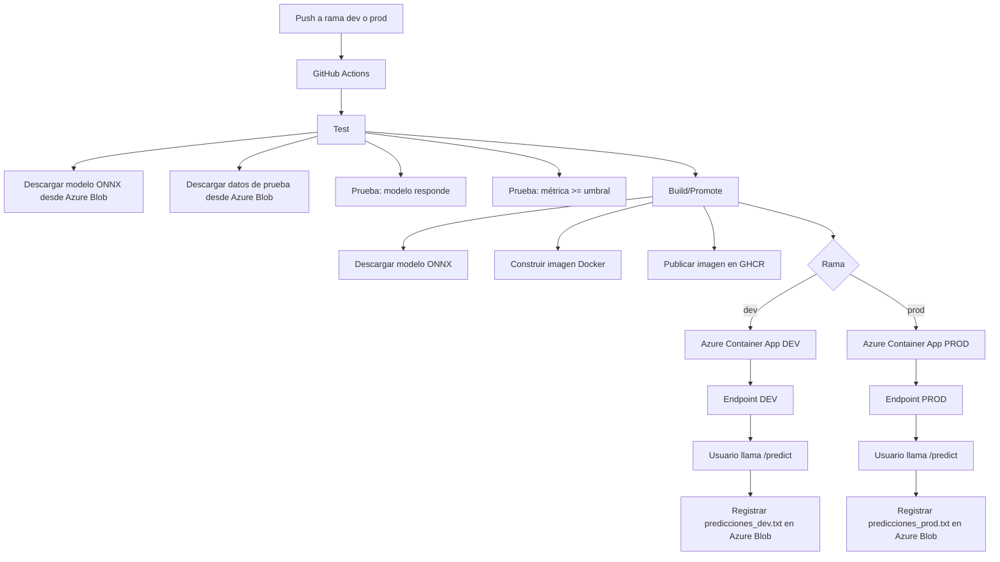

# Arquitectura del sistema de despliegue automático

## Diagrama Mermaid

## Componentes

| Componente | Rol |
|---|---|
| GitHub | Versionamiento y gestión de ramas |
| GitHub Actions | Automatización CI/CD |
| Azure Blob Storage | Almacenamiento externo de modelo, datos y logs |
| ONNX Runtime | Ejecución portable del modelo |
| FastAPI | API para usuario final |
| Docker | Empaquetado de la aplicación |
| GHCR | Registro de imágenes Docker |
| Azure Container Apps | Despliegue cloud de endpoints dev/prod |

## Separación de ambientes

| Rama | Endpoint | Archivo de predicciones |
|---|---|---|
| dev | nutrition-advisor-dev | logs/predicciones_dev.txt |
| prod | nutrition-advisor-prod | logs/predicciones_prod.txt |
